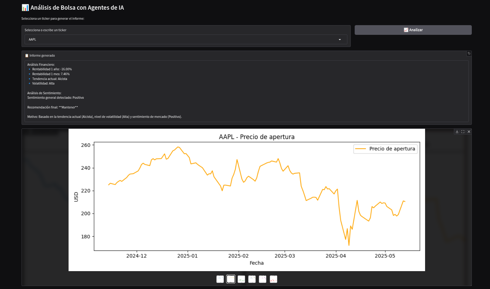

# 📈 Análisis Bursátil con Agentes de IA

Proyecto académico que implementa un sistema de análisis financiero y de sentimiento para acciones en bolsa, utilizando múltiples **agentes de inteligencia artificial** y visualización con Python + Gradio.

Permite generar un informe detallado sobre una acción ingresada por su **ticker**, acompañado de **gráficos interactivos** de evolución de precios y métricas clave del mercado.



---

## 🧠 Agentes implementados

- `agente_financiero`: analiza tendencias, rentabilidades y volatilidad a partir de datos reales del mercado (usa yfinance, con fallback a otras APIs).
- `agente_sentimiento`: extrae sentimiento de mercado a partir de titulares simulados (GPT / Gemini).
- `agente_analista`: fusiona análisis financiero + sentimiento y genera una recomendación (`Comprar`, `Vender`, `Mantener`).
- `agente_grafico`: genera automáticamente 6 gráficos clave para visualizar el comportamiento de la acción.

---

## ⚙️ Tecnologías utilizadas

- [Python 3.10+](https://www.python.org/)
- [Gradio](https://www.gradio.app/)
- [yfinance](https://pypi.org/project/yfinance/)
- [matplotlib](https://matplotlib.org/)
- [yahooquery](https://pypi.org/project/yahooquery/)
- [alpha_vantage](https://www.alphavantage.co/)
- [OpenAI / Gemini API] (opcional, para análisis de sentimiento)

---

## 📁 Estructura del proyecto

proyecto_bursatil/
├── agentes/
│ ├── agente_analista.py
│ ├── agente_financiero.py
│ ├── agente_sentimiento.py
│ └── agente_grafico.py
├── utils/
│ └── ...
├── img/ # Imágenes generadas automáticamente
├── app.py # Interfaz Gradio principal
├── requirements.txt
└── README.md

---

## 🚀 ¿Cómo ejecutarlo?

### 1. Clona el repositorio

```bash
git clone https://github.com/isma2697/proyecto_bursatil.git
cd proyecto_bursatil

2. Instala las dependencias
pip install -r requirements.txt

3. Crea tu archivo .env (opcional)
# .env
OPENAI_API_KEY=sk-...
ALPHA_VANTAGE_API_KEY=...

4. Ejecuta la app
python app.py
💡 Usa share=True si quieres compartir tu demo online:
app.launch(share=True)

📊 Ejemplo de análisis generado

Análisis Financiero:
• Rentabilidad 1 año: -1.60%
• Rentabilidad 1 mes: 7.46%
• Tendencia actual: Alcista
• Volatilidad: Alta

Análisis de Sentimiento:
Sentimiento general detectado: Positivo

Recomendación final: **Mantener**
Motivo: Basado en la tendencia actual (Alcista), nivel de volatilidad (Alta) y sentimiento de mercado (Positivo).
🧼 Notas
Las imágenes se generan temporalmente en la carpeta img/ y se eliminan automáticamente con cada análisis.

El sistema cambia de proveedor de datos (yfinance → yahooquery → alphavantage) si ocurre un error o bloqueo.

Compatible con Dark Mode de Gradio.

📄 Licencia
MIT © 2025 - Proyecto académico